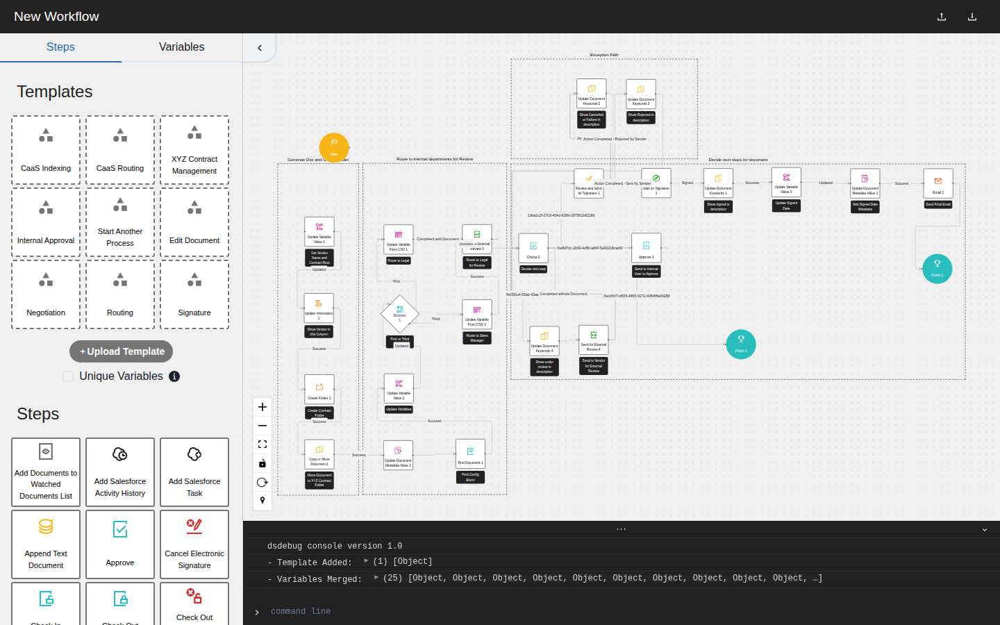

# DSDebug

Visual tooling for building and debugging DocuSign CLM workflows.

At Bitwise Industries, tracing a variable through a large workflow meant
reading a dense exported JSON definition by hand. DSDebug parses those exports
and renders the workflow as an interactive graph, reducing an afternoon of
manual inspection to minutes of visual tracing.

[Live application](https://dsdebug-prod.vercel.app/) ·
[Portfolio case study](https://timcis.com/projects/dsdebug) ·
[Original 2022 tracer](https://github.com/timcisneros/dsdebug)



## What it does

- Imports exported DocuSign CLM workflow definitions.
- Renders steps, phases, decisions, success paths, and failure paths with
  React Flow.
- Traces typed variables through the steps that read and update them.
- Supports drag-and-drop authoring from a palette of CLM step types.
- Includes reusable workflow templates and an embedded inspection console.
- Keeps parsing and graph interaction client-side for immediate feedback.

## Project history

The 2022 version was an internal productivity tool focused on variable tracing.
This 2023 rebuild retained that tracer and added the visual editor, template
library, and console, turning the focused debugging aid into a workflow
workbench. Both versions remain available above.

## Stack

Next.js 13 · React 18 · React Flow · Chakra UI · JSONPath Plus · React DnD

## Run locally

```sh
npm ci
npm run dev
```

Open `http://localhost:3000`, load a bundled template, or upload an exported
workflow definition.

Create a production build with:

```sh
npm run build
```

## Scope

This repository is a workflow visualization and authoring tool, not a hosted
DocuSign CLM service. Workflow definitions are processed in the browser; the
repository does not include client workflow data or credentials.
